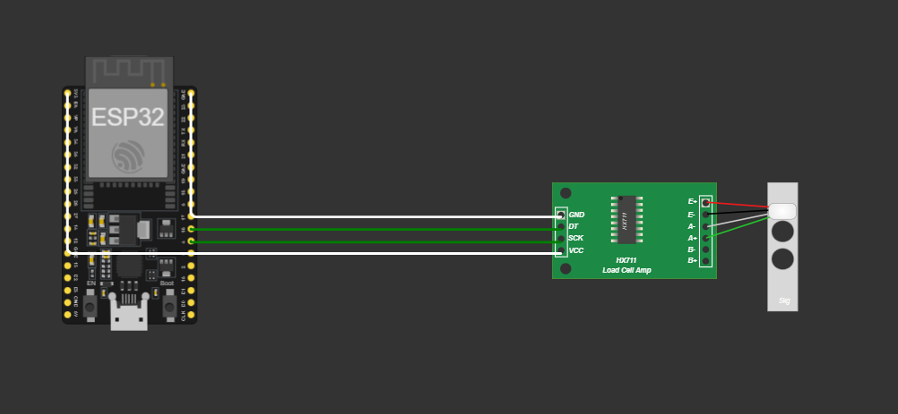
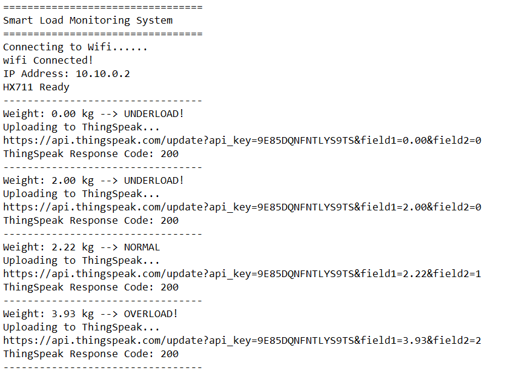
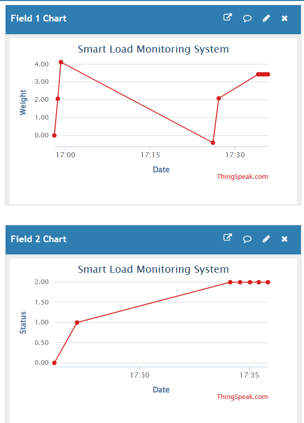

# Smart Load Monitoring System

## Industrial Internet of Things Project

**Submitted by:**
**K. Pranay Kumar**
Department of Electronics and Communication Engineering
VIT-AP University

---

## Problem Statement

The uninterrupted oversight of mass is critical for operational environments demanding the swift identification of load discrepancies. Conventional manual tracking necessitates perpetual human intervention and often results in sluggish reaction times. Consequently, this initiative seeks to engineer a Smart Load Monitoring System capable of persistent weight quantification and the autonomous generation of notifications when measurements deviate from specified threshold boundaries.

---

## Scope of the Solution

Utilizing a load cell paired with the HX711 sensor module, the proposed architecture facilitates the persistent observation of mass measurements. This framework is engineered to identify both deficient and excessive load states by referencing established threshold parameters, ensuring the delivery of instantaneous status updates. The initiative illustrates the efficacy of IoT-centric oversight frameworks in streamlining autonomous weight tracking processes.

---

## Required Components

### Hardware Components

* ESP32 Development Board
* HX711 Weight Sensor Module
* Load Cell
* Jumper Wires

### Software Components

* Wokwi Simulation Platform
* Arduino IDE

### Cloud Platform

* ThingSpeak

---

## Wokwi Simulation Platform

Wokwi is an online electronics simulation platform used to design, simulate, and test embedded systems without requiring physical hardware. It allows real-time verification of the circuit operation and program execution.

---

## Programming Language

Embedded C/C++ is used to write the program for the ESP32. The program performs sensor initialization, weight measurement, threshold comparison, and status generation.

---

## Libraries Used

* WiFi.h
* HTTPClient.h
* HX711.h

---

## Block Diagram


---

## Working Principle

* The load cell measures the applied weight.
* The HX711 converts the sensor signal into digital values.
* The ESP32 reads the weight values.
* The measured weight is compared with minimum and maximum threshold values.
* If the weight is below the minimum limit, an UNDERLOAD condition is generated.
* If the weight is within the limits, a NORMAL condition is generated.
* If the weight exceeds the maximum limit, an OVERLOAD condition is generated.
* The process repeats continuously.

---

## Circuit Diagram



---

## Serial Monitor Output



---

## ThingSpeak Dashboard Output



---

## Demo Video

The demonstration video is submitted separately.

---

## Source Code

The complete Arduino source code is available in:

```text
sketch.ino
```

---

## Project Files

* sketch.ino
* diagram.json
* Circuit.png
* Dashboard.png
* SerialMonitor.png
* README.md

## **Demo Video Link**
https://drive.google.com/file/d/1N5DZPckNNKTsOIwMnAcTlHribAsi7YBa/view?usp=sharing
